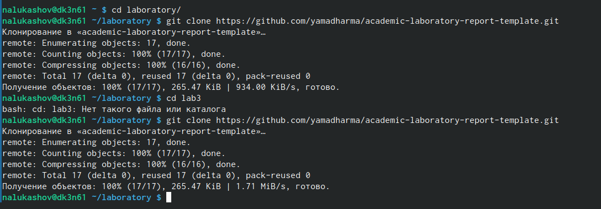
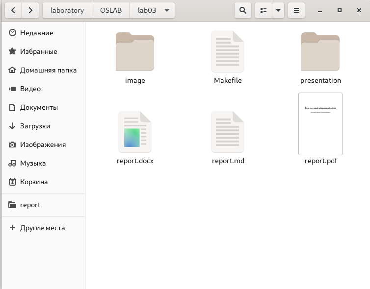
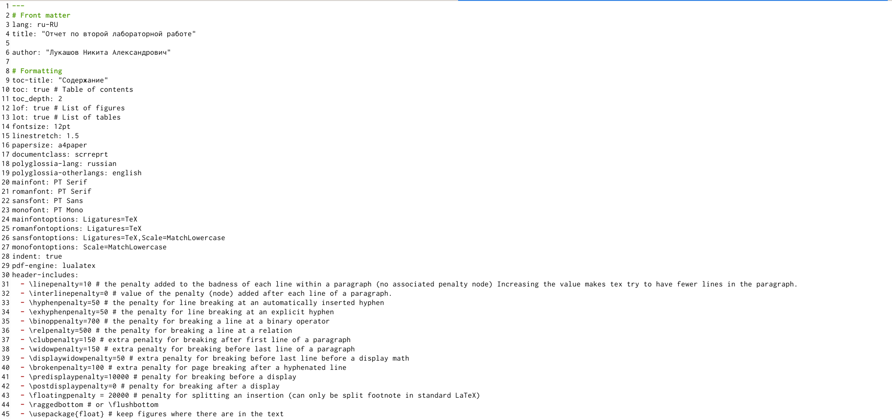
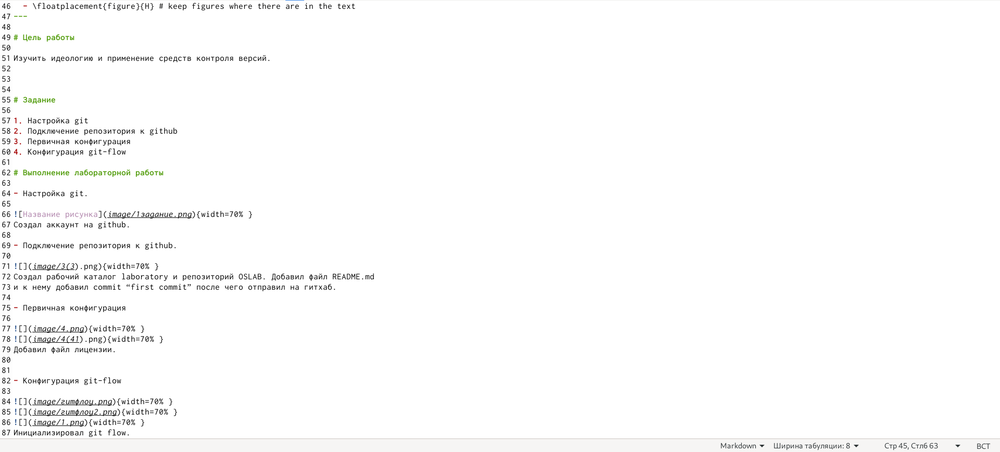
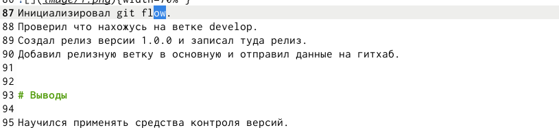

---
## Front matter
lang: ru-RU
title: Операционные системы
author: |
	Nikita A. Lukashov\inst{1}
institute: |
	\inst{1}RUDN University, Moscow, Russian Federation

## Formatting
toc: false
slide_level: 2
theme: metropolis
header-includes: 
 - \metroset{progressbar=frametitle,sectionpage=progressbar,numbering=fraction}
 - '\makeatletter'
 - '\beamer@ignorenonframefalse'
 - '\makeatother'
aspectratio: 43
section-titles: false
---

# Лабораторная работа №3

## Цели работы

Научиться оформлять отчёты с помощью легковесного языка разметки Markdown.

## Задачи

- Сделать отчёт по предыдущей лабораторной работе в формате Markdown.

## Создание шаблона отчета

## Размещение каталогов

## Оформление отчета через маркдаун

## Оформление отчета через маркдаун

## Оформление отчета через маркдаун

## Вывод
Научился оформлять отчеты с помощью маркдауна.

