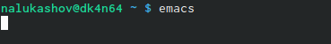
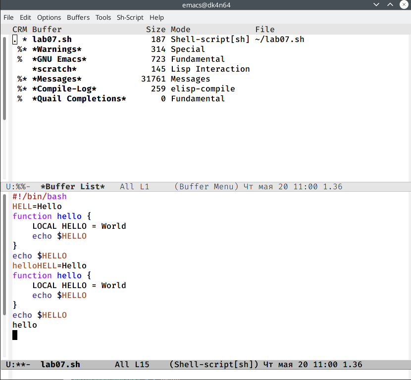
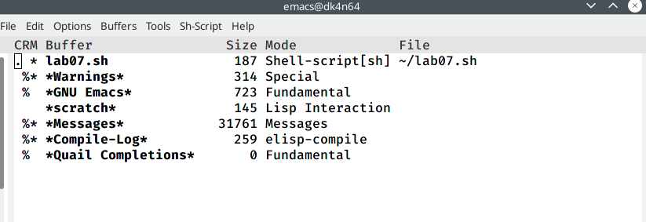
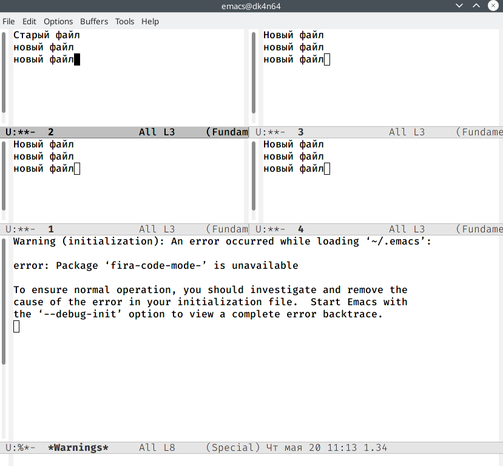

---
# Front matter
lang: ru-RU
title: "Отчет по шестой лабораторной работе"

author: "Лукашов Никита Александрович"

# Formatting
toc-title: "Содержание"
toc: true # Table of contents
toc_depth: 2
lof: true # List of figures
lot: true # List of tables
fontsize: 12pt
linestretch: 1.5
papersize: a4paper
documentclass: scrreprt
polyglossia-lang: russian
polyglossia-otherlangs: english
mainfont: PT Serif
romanfont: PT Serif
sansfont: PT Sans
monofont: PT Mono
mainfontoptions: Ligatures=TeX
romanfontoptions: Ligatures=TeX
sansfontoptions: Ligatures=TeX,Scale=MatchLowercase
monofontoptions: Scale=MatchLowercase
indent: true
pdf-engine: lualatex
header-includes:
  - \linepenalty=10 # the penalty added to the badness of each line within a paragraph (no associated penalty node) Increasing the value makes tex try to have fewer lines in the paragraph.
  - \interlinepenalty=0 # value of the penalty (node) added after each line of a paragraph.
  - \hyphenpenalty=50 # the penalty for line breaking at an automatically inserted hyphen
  - \exhyphenpenalty=50 # the penalty for line breaking at an explicit hyphen
  - \binoppenalty=700 # the penalty for breaking a line at a binary operator
  - \relpenalty=500 # the penalty for breaking a line at a relation
  - \clubpenalty=150 # extra penalty for breaking after first line of a paragraph
  - \widowpenalty=150 # extra penalty for breaking before last line of a paragraph
  - \displaywidowpenalty=50 # extra penalty for breaking before last line before a display math
  - \brokenpenalty=100 # extra penalty for page breaking after a hyphenated line
  - \predisplaypenalty=10000 # penalty for breaking before a display
  - \postdisplaypenalty=0 # penalty for breaking after a display
  - \floatingpenalty = 20000 # penalty for splitting an insertion (can only be split footnote in standard LaTeX)
  - \raggedbottom # or \flushbottom
  - \usepackage{float} # keep figures where there are in the text
  - \floatplacement{figure}{H} # keep figures where there are in the text
---

# Цель работы

Познакомиться с операционной системой Linux. Получить практические навыки работы с редактором Emacs.

# Задание

1. Ознакомиться с теоретическим материалом.
2. Ознакомиться с редактором emacs.
3. Выполнить упражнения.
4. Ответить на контрольные вопросы.

# Выполнение лабораторной работы

{width=70% }
Вызвал редактор emacs

{width=70% }
Зашел в редактор и создал файл "lab07.sh" и набрал текст.
Сохранил файл с помощью (C-x C-s)
Провел стандартные процедуры с помощью комбинаций клавиш.
Научился использовать команды по перемещению курсора.

{width=70% }
Вывел список активных буферов.

{width=70% }
Поделил фрейм на 4 части
Ввел несколько строк текста
Перешел в режим поиска и заменил часть текста 'Новый текст" на "Старый текст"

# Контрольные вопросы

1. Emacs представляет собой мощный экранный редактор текста, написанный на

языке высокого уровня Elisp.

2. Развитие Emacs в сторону его многогранности послужило причиной того, что и без

того интуитивно непонятная программа стала чрезвычайно сложной в применении. В частности, управление осуществляется при помощи различных клавиатурных комбинаций, запомнить которые будет непросто.

3. Буфер – что-то, состоящее из текста.

Окно – область с одним из буферов.

4. В одном окне можно открыть больше 10 буферов.

5. После запуска emacs без каких-либо параметров в основном окне отображается буфер *scratch*, который используется для оценки выражений Emacs Lisp, а также для заметок, которые вы не хотите сохранять. Этот буфер не сохраняется автоматически.

6. Чтобы ввести следующую комбинацию C-c | я нажму клавиши: Control+c и Shift+\, и для C-c C-|: Control+c и Control+Shift+\.

7. Поделить текущее окно на две части можно двумя комбинациями клавиш:

C-x 3 или C-x 2.

8. Настроить или расширить Emacs можно написав или изменив файл ~/.emacs.

9. Клавиша ß выполняет функцию перемещения курсора в открытом окне также, как и многие другие клавиши её можно переназначить.

10. Редактор emacs показался мне удобнее из-за возможности открытия нескольких окон с буферами и работать комбинациями клавиш в этот редакторе мне было проще

# Вывод

Познакомился с операционной системой Linux, получил практические навыки работы с редактором Emacs. 
