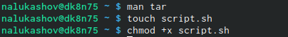

---
## Front matter
lang: ru-RU
title: Операционные системы
author: |
	Nikita A. Lukashov\inst{1}
institute: |
	\inst{1}RUDN University, Moscow, Russian Federation

## Formatting
toc: false
slide_level: 2
theme: metropolis
header-includes: 
 - \metroset{progressbar=frametitle,sectionpage=progressbar,numbering=fraction}
 - '\makeatletter'
 - '\beamer@ignorenonframefalse'
 - '\makeatother'
aspectratio: 43
section-titles: false
---

# Лабораторная работа №11

## Цели работы

изучить основы программирования в оболочке ОС UNIX/Linux,научиться писать небольшие командные файлы. 

## Задачи

1. Написать скрипт, который при запуске будет делать резервную копию самого се-бя (то есть файла, в котором содержится его исходный код) в другую директориюbackupв вашем домашнем каталоге. При этом файл должен архивироваться од-ним из архиваторов на выборzip,bzip2илиtar. Способ использования командархивации необходимо узнать, изучив справку.
2. Написать пример командного файла, обрабатывающего любое произвольноечисло аргументов командной строки, в том числепревышающеедесять. Напри-мер, скрипт может последовательно распечатывать значения всех переданныхаргументов.
3. Написать командный файл — аналог командыls(без использования самой этойкоманды и командыdir). Требуется, чтобы он выдавал информацию о нужномкаталоге и выводил информацию о возможностях доступа к файлам этого ката-лога.
4. Написать командный файл, который получает в качестве аргумента команднойстроки формат файла (.txt,.doc,.jpg,.pdfи т.д.) и вычисляет количествотаких файлов в указанной директории. Путь к директории также передаётся ввиде аргумента командной строки.

## Примеры

{width=70% }
{width=70% }
{width=70% }
{width=70% }

## 
{width=70% }
{width=70% }
{width=70% }

 
## 

{width=70% }
{width=70% }

## 

{width=70% }
{width=70% }
{width=70% }

## Вывод

Изучил основы программирования в оболочке ОС UNIX/Linux, научился писать небольшие командные файлы.

