---
# Front matter
lang: ru-RU
title: "Отчет по 11 лабораторной работе"

author: "Лукашов Никита Александрович"

# Formatting
toc-title: "Содержание"
toc: true # Table of contents
toc_depth: 2
lof: true # List of figures
lot: true # List of tables
fontsize: 12pt
linestretch: 1.5
papersize: a4paper
documentclass: scrreprt
polyglossia-lang: russian
polyglossia-otherlangs: english
mainfont: PT Serif
romanfont: PT Serif
sansfont: PT Sans
monofont: PT Mono
mainfontoptions: Ligatures=TeX
romanfontoptions: Ligatures=TeX
sansfontoptions: Ligatures=TeX,Scale=MatchLowercase
monofontoptions: Scale=MatchLowercase
indent: true
pdf-engine: lualatex
header-includes:
  - \linepenalty=10 # the penalty added to the badness of each line within a paragraph (no associated penalty node) Increasing the value makes tex try to have fewer lines in the paragraph.
  - \interlinepenalty=0 # value of the penalty (node) added after each line of a paragraph.
  - \hyphenpenalty=50 # the penalty for line breaking at an automatically inserted hyphen
  - \exhyphenpenalty=50 # the penalty for line breaking at an explicit hyphen
  - \binoppenalty=700 # the penalty for breaking a line at a binary operator
  - \relpenalty=500 # the penalty for breaking a line at a relation
  - \clubpenalty=150 # extra penalty for breaking after first line of a paragraph
  - \widowpenalty=150 # extra penalty for breaking before last line of a paragraph
  - \displaywidowpenalty=50 # extra penalty for breaking before last line before a display math
  - \brokenpenalty=100 # extra penalty for page breaking after a hyphenated line
  - \predisplaypenalty=10000 # penalty for breaking before a display
  - \postdisplaypenalty=0 # penalty for breaking after a display
  - \floatingpenalty = 20000 # penalty for splitting an insertion (can only be split footnote in standard LaTeX)
  - \raggedbottom # or \flushbottom
  - \usepackage{float} # keep figures where there are in the text
  - \floatplacement{figure}{H} # keep figures where there are in the text
---

# Цель работы

изучить основы программирования в оболочке ОС UNIX/Linux,научиться писать небольшие командные файлы. 

# Задание

1. Написать скрипт, который при запуске будет делать резервную копию самого се-бя (то есть файла, в котором содержится его исходный код) в другую директориюbackupв вашем домашнем каталоге. При этом файл должен архивироваться од-ним из архиваторов на выборzip,bzip2илиtar. Способ использования командархивации необходимо узнать, изучив справку.
2. Написать пример командного файла, обрабатывающего любое произвольноечисло аргументов командной строки, в том числепревышающеедесять. Напри-мер, скрипт может последовательно распечатывать значения всех переданныхаргументов.
3. Написать командный файл — аналог командыls(без использования самой этойкоманды и командыdir). Требуется, чтобы он выдавал информацию о нужномкаталоге и выводил информацию о возможностях доступа к файлам этого ката-лога.
4. Написать командный файл, который получает в качестве аргумента команднойстроки формат файла (.txt,.doc,.jpg,.pdfи т.д.) и вычисляет количествотаких файлов в указанной директории. Путь к директории также передаётся ввиде аргумента командной строки.

# Выполнение лабораторной работы

1. Написал скрипт, который при запуске будет делать резервную копию самого себя (то есть файла, в котором содержится его исходный код) в другую директорию backup в домашнем каталоге. При этом файл должен архивироваться одним из архиваторов на выбор zip, bzip2 или tar. Способ использования команд архивации узнала, изучив справку.

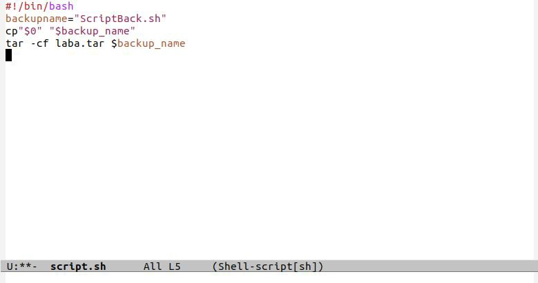{width=70% }
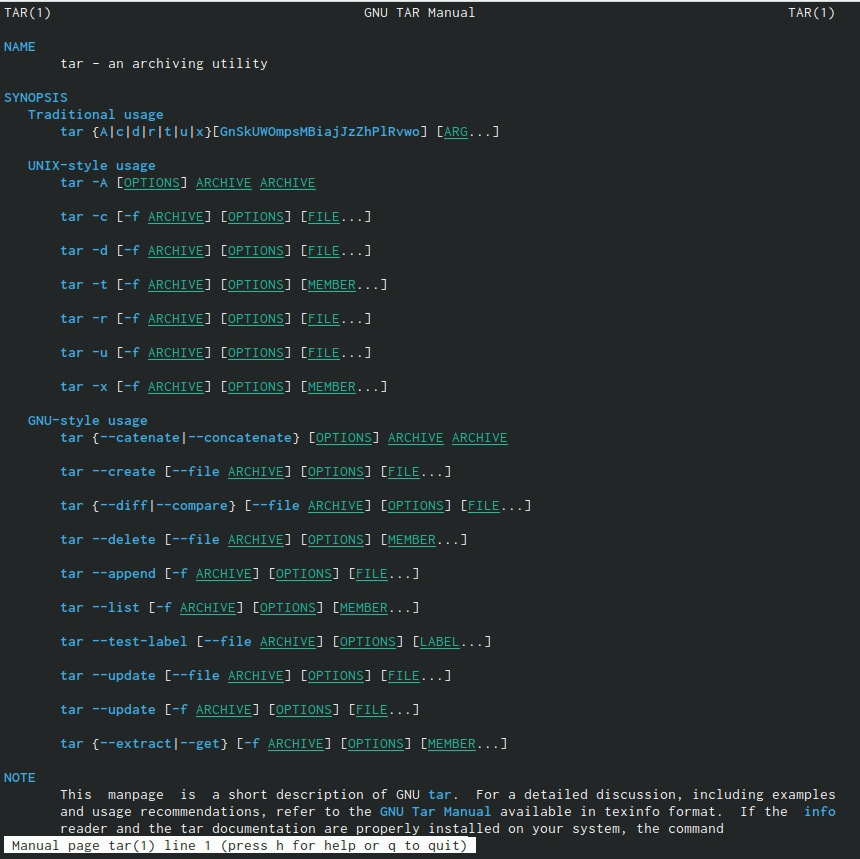{width=70% }
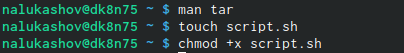{width=70% }
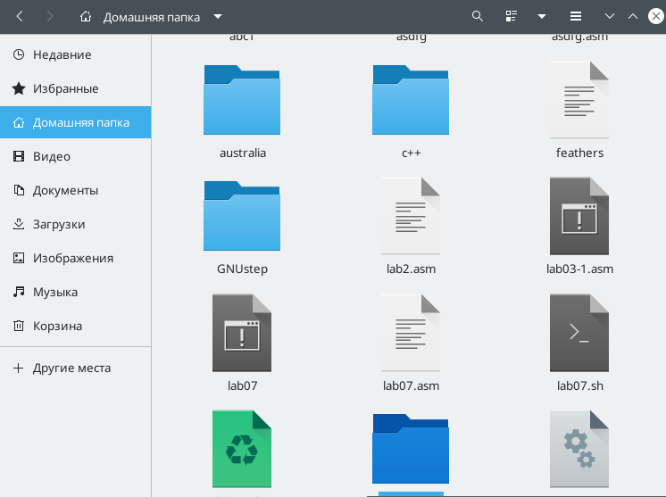{width=70% }

2. Написала пример командного файла, обрабатывающего любое произвольное

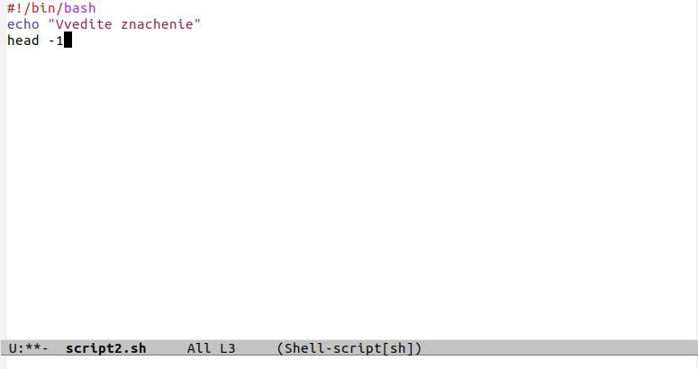{width=70% }
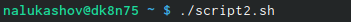{width=70% }
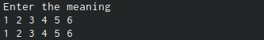{width=70% }

3. Написала командный файл — аналог команды ls (без использования самой этой
команды и команды dir). Требуется, чтобы он выдавал информацию о нужном
каталоге и выводил информацию о возможностях доступа к файлам этого каталога.

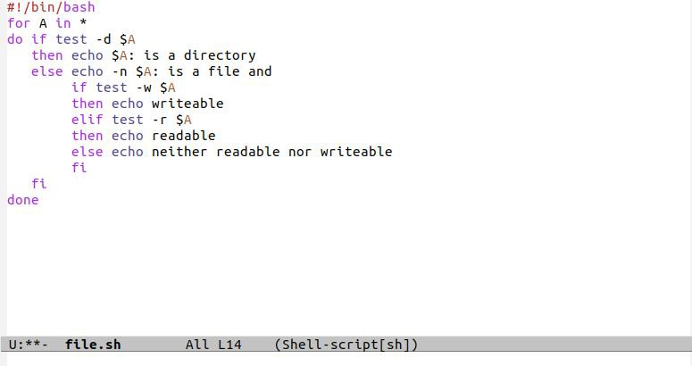{width=70% }
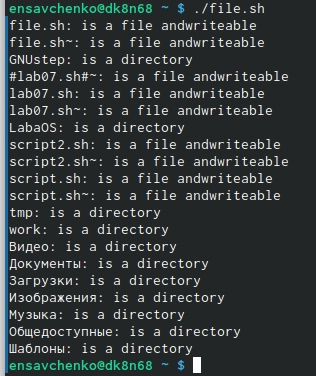{width=70% }

4. Написала командный файл, который получает в качестве аргумента командной строки формат файла (.txt, .doc, .jpg, .pdf и т.д.) и вычисляет количество таких файлов в указанной директории. Путь к директории также передаётся в виде аргумента командной строки. 

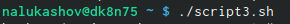{width=70% }
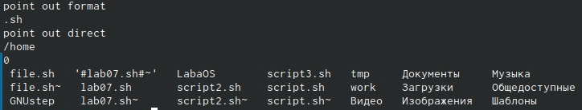{width=70% }
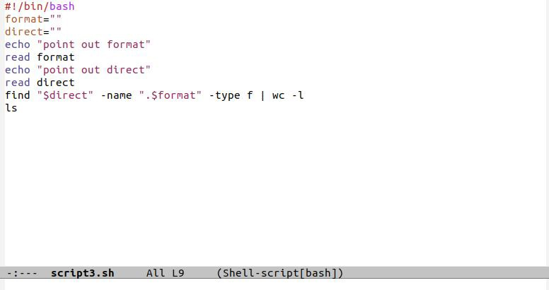{width=70% }

# Контрольные вопросы

1. Командный процессор (командная оболочка, интерпретатор команд shell) —

это программа, позволяющая пользователю взаимодействовать с операционной системой компьютера. В операционных системах типа UNIX/Linux наиболее часто

используются следующие реализации командных оболочек:

– оболочка Борна (Bourne shell или sh) — стандартная командная оболочка

UNIX/Linux, содержащая базовый, но при этом полный набор функций;

– С-оболочка (или csh) — надстройка над оболочкой Борна, использующая Сподобный синтаксис команд с возможностью сохранения истории выполнения команд;

– оболочка Корна (или ksh) — напоминает оболочку С, но операторы управления

программой совместимы с операторами оболочки Борна;

– BASH — сокращение от Bourne Again Shell (опять оболочка Борна), в основе своей совмещает свойства оболочек С и Корна (разработка компании Free Software

Foundation).

2. POSIX (Portable Operating System Interface for Computer Environments) — набор

стандартов описания интерфейсов взаимодействия операционной системы и прикладных программ.

Стандарты POSIX разработаны комитетом IEEE (Institute of Electrical and

Electronics Engineers) для обеспечения совместимости различных UNIX/Linuxподобных операционных систем и переносимости прикладных программ на уровне исходного кода. POSIX-совместимые оболочки разработаны на базе оболочки Корна.

3. Командный процессор bash обеспечивает возможность использования переменных типа строка символов. Имена переменных могут быть выбраны пользователем.

Пользователь имеет возможность присвоить переменной значение некоторой строки символов. Например, команда mark=/usr/andy/bin присваивает значение строки символов /usr/andy/bin переменной mark типа строка символов.

Значение, присвоенное некоторой переменной, может быть впоследствии использовано. Для этого в соответствующем месте командной строки должно быть

употреблено имя этой переменной, которому предшествует метасимвол $. Например, команда mv afile ${mark} переместит файл afile из текущего каталога в каталог с абсолютным полным именем /usr/andy/bin.

Использование значения, присвоенного некоторой переменной, называется подстановкой. Для того чтобы имя переменной не сливалось с символами, которые могут следовать за ним в командной строке, при подстановке в общем случае используется следующая форма записи: ${имя переменной}

Например, использование команд b=/tmp/andyls -l myfile > ${b}lssudo apt-get install texlive-luatex приведёт к переназначению стандартного вывода команды ls с терминала на файл /tmp/andy-ls, а использование команды ls -l>$bls приведёт к подстановке в командную строку значения переменной bls. Если переменной bls не было предварительно присвоено никакого значения, то её значением будет символ пробела.

Оболочка bash позволяет работать с массивами. Для создания массива используется команда set с флагом -A. За флагом следует имя переменной, а затем список

значений, разделённых пробелами. Например, set -A states Delaware Michigan "New Jersey"

Далее можно сделать добавление в массив, например, states[49]=Alaska.

Индексация массивов начинается с нулевого элемента.

4, 5, 6. Команда let является показателем того, что последующие аргументы представляют собой выражение, подлежащее вычислению. Простейшее выражение — это единичный терм (term), обычно целочисленный. Команда let берет два операнда и присваивает их переменной. Положительным моментом команды let можно считать то, что для идентификации переменной ей не нужен знак доллара; вы можете писать команды типа let sum=x+7, и let будет искать переменную x и добавлять к ней 7.

Команда let также расширяет другие выражения let, если они заключены в двойные круглые скобки. Таким способом вы можете создавать довольно сложные выражения.

Команда let не ограничена простыми арифметическими выражениями.

Команда read позволяет читать значения переменных со стандартного ввода:

echo "Please enter Month and Day of Birth ?"

read mon day trash

В переменные mon и day будут считаны соответствующие значения, введённые с клавиатуры, а переменная trash нужна для того, чтобы отобрать всю избыточно введённую информацию и игнорировать её.

7. – HOME — имя домашнего каталога пользователя. Если команда cd вводится без

аргументов, то происходит переход в каталог, указанный в этой переменной.

– IFS — последовательность символов, являющихся разделителями в командной

строке, например, пробел, табуляция и перевод строки (new line).

– MAIL — командный процессор каждый раз перед выводом на экран промптера

проверяет содержимое файла, имя которого указано в этой переменной, и если

содержимое этого файла изменилось с момента последнего ввода из него, то перед тем, как вывести на терминал промптер, командный процессор выводит на

терминал сообщение You have mail (у Вас есть почта).

– TERM — тип используемого терминала.

– LOGNAME — содержит регистрационное имя пользователя, которое устанавливается автоматически при входе в систему

8, 9. Такие символы, как ' < > * ? | \ " &, являются метасимволами и имеют для командного процессора специальный смысл. Снятие специального смысла с метасимвола называется экранированием метасимвола. Экранирование может быть

осуществлено с помощью предшествующего метасимволу символа \, который, в

свою очередь, является метасимволом. Для экранирования группы метасимволов нужно заключить её в одинарные кавычки. Строка, заключённая в двойные кавычки,

# Вывод

 Изучил основы программирования в оболочке ОС UNIX/Linux, научился писать небольшие командные файлы.
