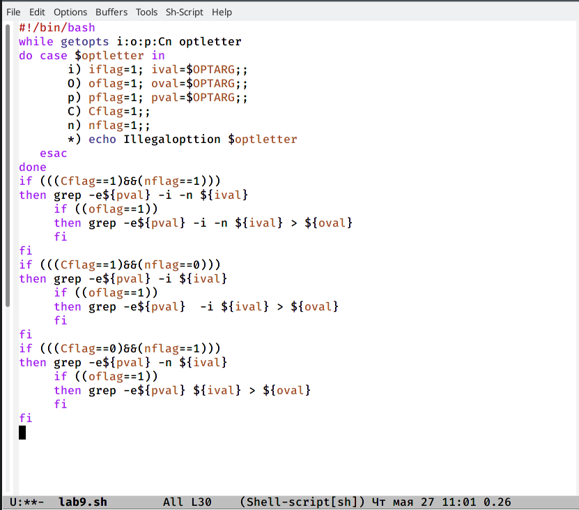
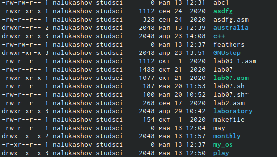
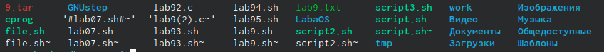

---
# Front matter
lang: ru-RU
title: "Презентация по лабораторной работе"
author: "Lukashov Nikita"
institute: \inst{1}RUDN University, Moscow, Russian Federation
	
date: 27.05.2021

## Formatting
toc: false
slide_level: 2
theme: metropolis
header-includes: 
 - \metroset{progressbar=frametitle,sectionpage=progressbar,numbering=fraction}
 - '\makeatletter'
 - '\beamer@ignorenonframefalse'
 - '\makeatother'
aspectratio: 43
section-titles: true
---

# Цель работы

Изучить основы программирования в оболочке ОС UNIX, научиться писать более сложные командные файлы с использованием логических управляющих конструкций и циклов. 

## Слайд 1

 
 

## Слайд 2
 
 

## Слайд 3
 
 

## Слайд 4
 
 

# Выводы

 Я изучил основы программирования в оболочке ОС UNIX, научился писать более сложные командные файлы с использованием логических управляющих конструкций и циклов. 

