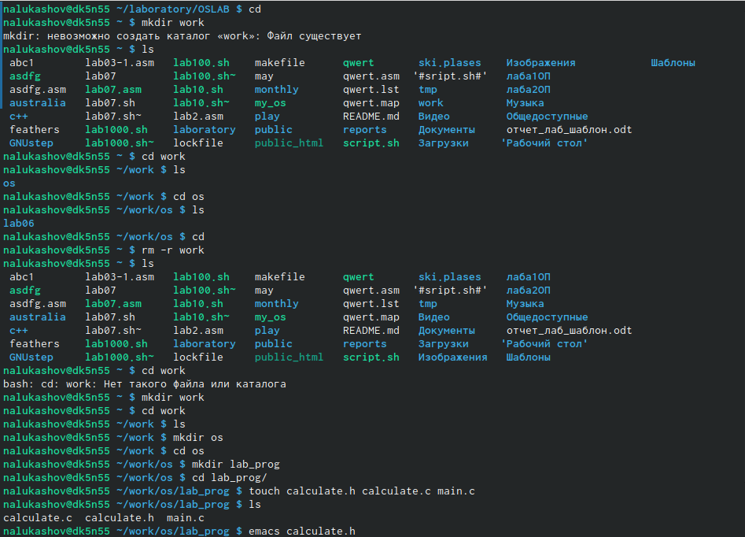
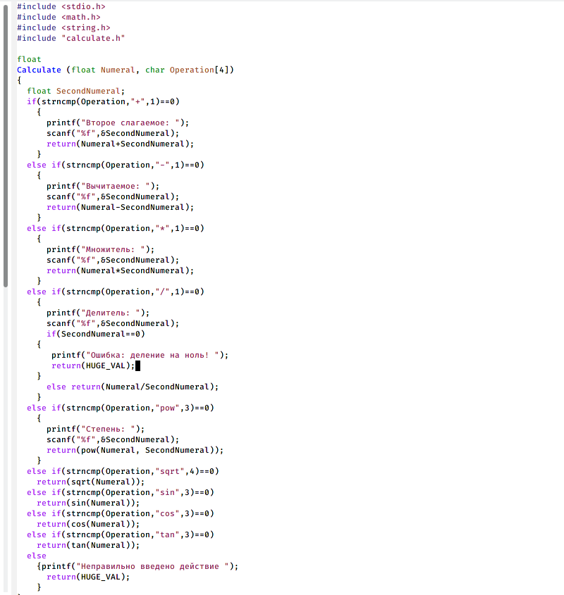
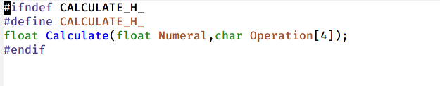
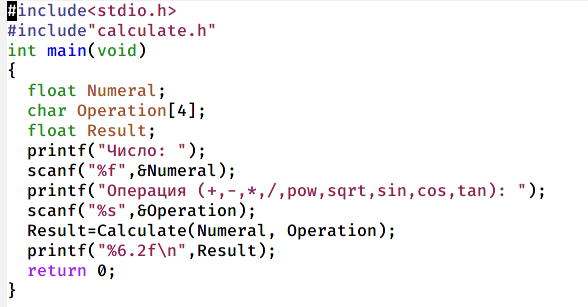
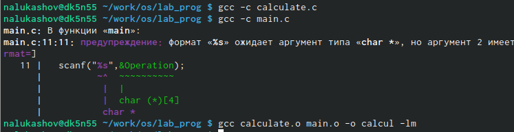
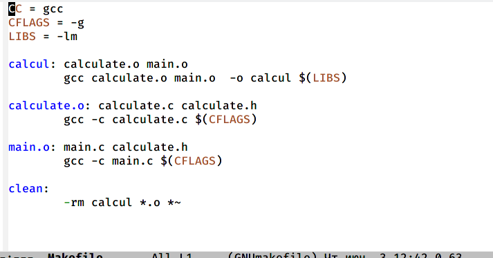
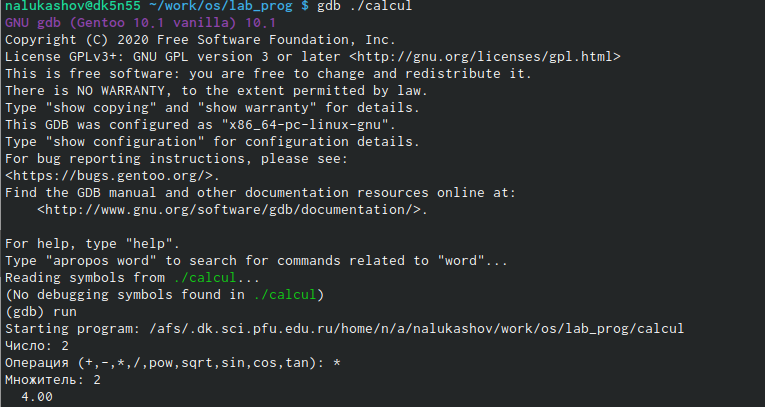
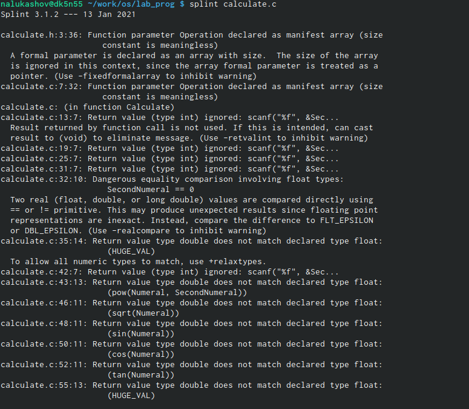
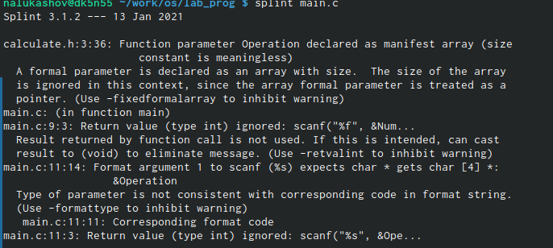

---
# Front matter
lang: ru-RU
title: "Презентация по лабораторной работе"
author: "Lukashov Nikita"
institute: \inst{1}RUDN University, Moscow, Russian Federation
	

## Formatting
toc: false
slide_level: 2
theme: metropolis
header-includes: 
 - \metroset{progressbar=frametitle,sectionpage=progressbar,numbering=fraction}
 - '\makeatletter'
 - '\beamer@ignorenonframefalse'
 - '\makeatother'
aspectratio: 43
section-titles: true
---

# Цель работы

Изучить основы программирования в оболочке ОС UNIX. Научиться писать бо-лее сложные командные файлы с использованием логических управляющих кон-струкций и циклов.

## Слайд 1

## Слайд 2

## Слайд 3

## Слайд 4

## Слайд 5
 

## Слайд 6
 

## Слайд 7
 

## Слайд 8
 

## Слайд 9
 

# Выводы

Приобрел простейшие навыки разработки, анализа, тестирования и отладки приложений в ОС типа UNIX/Linux на примере создания на языке программирования C калькулятора с простейшими функциями.
