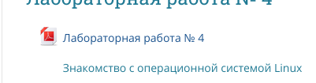
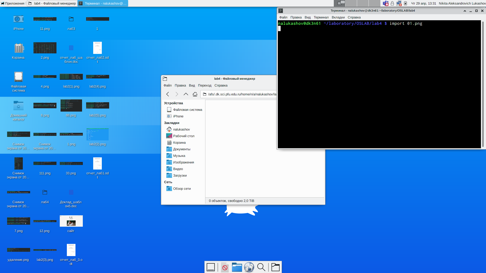
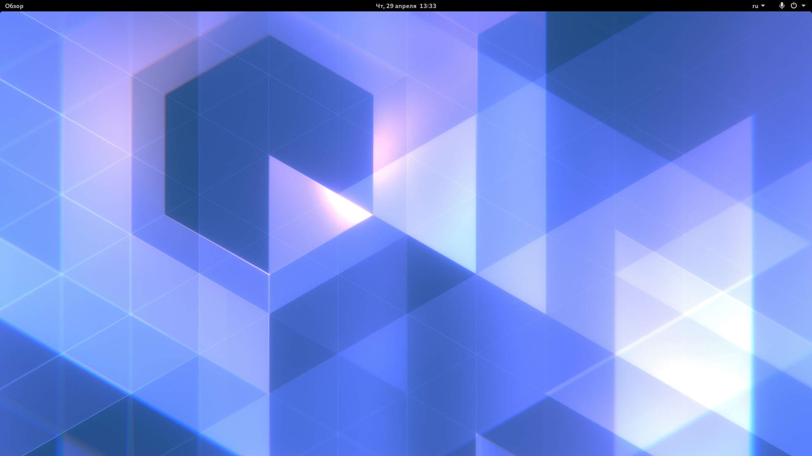
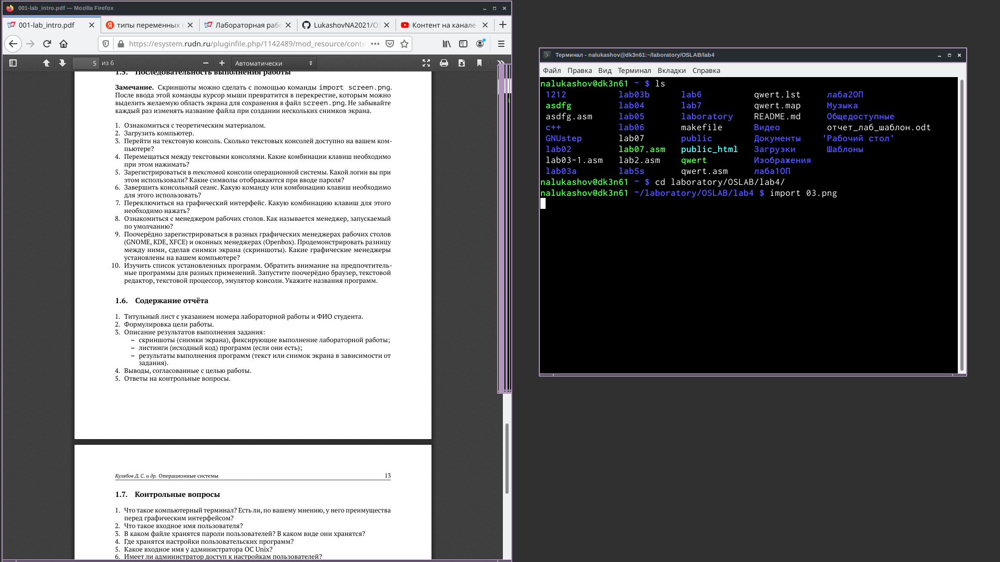
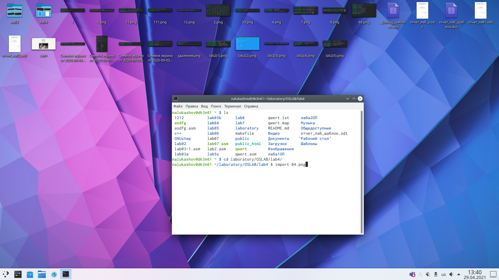
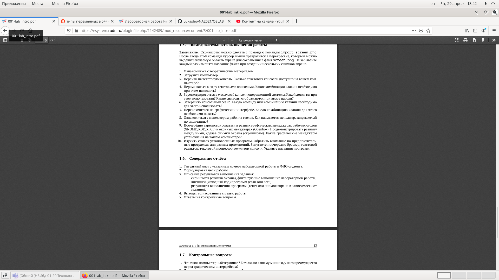
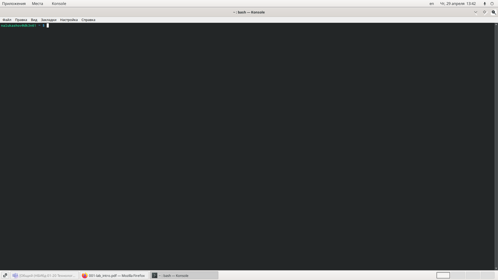
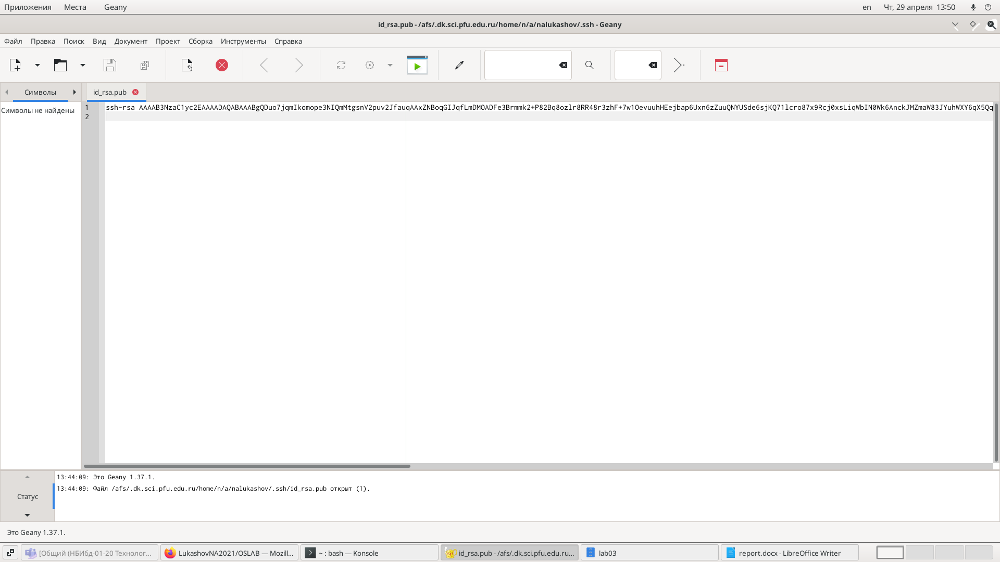
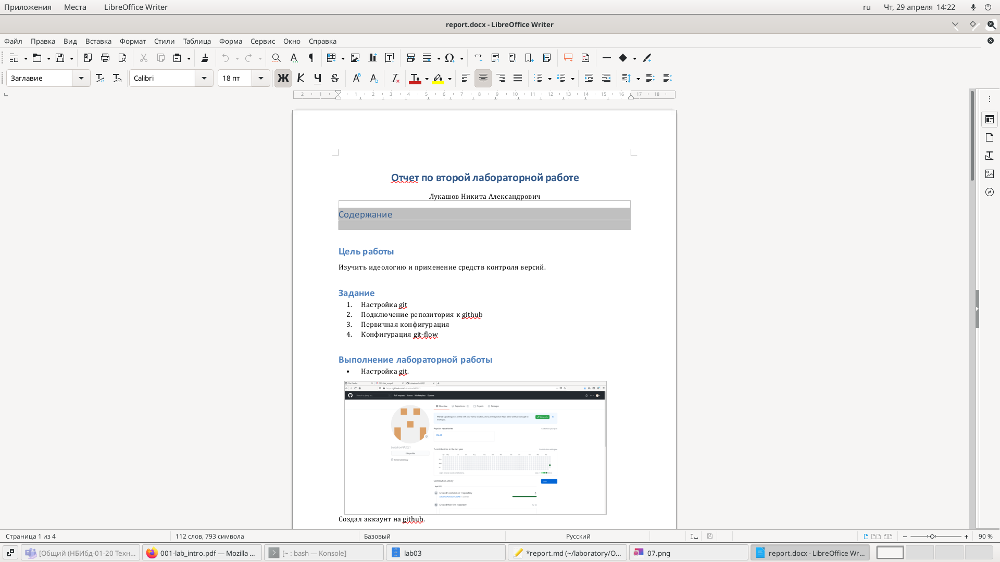

---
## Front matter
lang: ru-RU
title: Операционные системы
author: |
	Nikita A. Lukashov\inst{1}
institute: |
	\inst{1}RUDN University, Moscow, Russian Federation

## Formatting
toc: false
slide_level: 2
theme: metropolis
header-includes: 
 - \metroset{progressbar=frametitle,sectionpage=progressbar,numbering=fraction}
 - '\makeatletter'
 - '\beamer@ignorenonframefalse'
 - '\makeatother'
aspectratio: 43
section-titles: false
---

# Лабораторная работа №4

## Цели работы

Познакомиться с операционной системой Linux,получить практические навыки
работы с консолью и некоторыми графическими менеджерами рабочих столов
операционной системы.

## Задачи

1. Ознакомиться стеоретическим материалом.
2. Загрузить компьютер.
3. Перейти на текстовую консоль.Сколько текстовых консолей доступно на
вашем ком-пьютере?
4. Перемещаться между текстовыми консолями.Какие комбинации клавиш
необходимопри этом нажимать?
5. Зарегистрироваться в текстовой консоли операционной системы.Какой
логин вы приэтом использовали? Какие символы отображаются при вводе
пароля?
6. Завершить консольный сеанс.Какую команду или комбинацию клавиш
необходимодля этого использовать?
7. Переключиться на графический интерфейс. Какую комбинацию клавиш
для этого необходимо нажать?
8. Ознакомиться с менеджером рабочих столов.Как называется менеджер,за-
пускаемый по умолчанию?
9. Поочерёдно зарегистрироваться в разных графических менеджерах рабо-
чих столов(GNOME,KDE,XFCE) и оконных менеджерах (Openbox).Продемон-
стрировать разницу между ними, сделав снимки экрана (скриншоты). Какие
графические менеджерыустановлены на вашем компьютере?
10. Изучить список установленных программ. Обратить внимание на пред-
почтительные программы для разных применений.Запустите поочерёдно
браузер,текстовой редактор,текстовой процессор,эмулятор консоли.Укажи-
6те названия программ.

## Ознакомление с учебным материалом и загрузка компьютера.

# Менеджеры рабочих столов

## XFCE

XFCE

## GNOME

GNOME

## OPENBOX

OPENBOX

## Plasma

Plasma

# Список установленных программ.

## Браузер

## Эмулятор консоли

## Текстовый редактор

## Текстовый процессор

## Вывод

Познакомился с операционной системой linux, получил практические навыки
работы с консолью и некоторыми графическими менеджерами рабочих столов
операционной системы.

