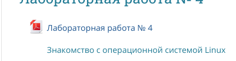
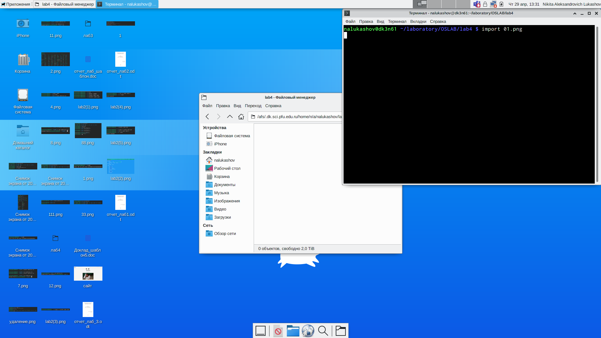
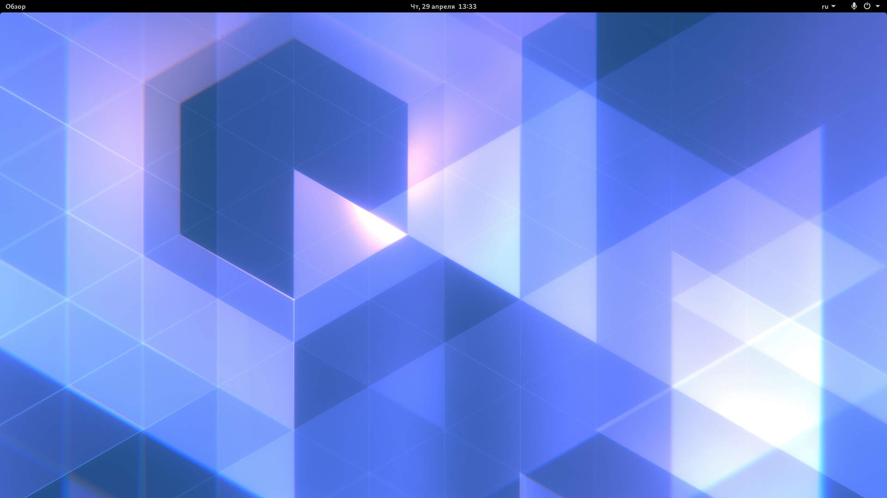
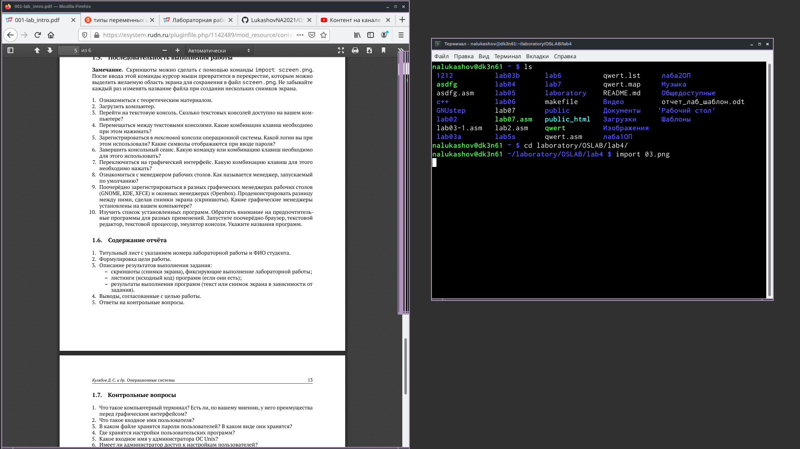
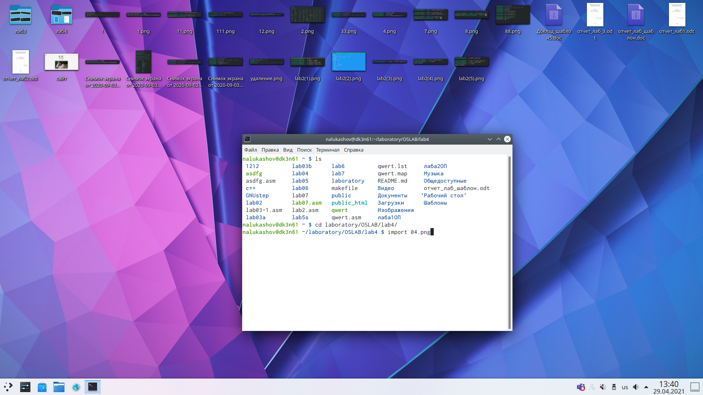
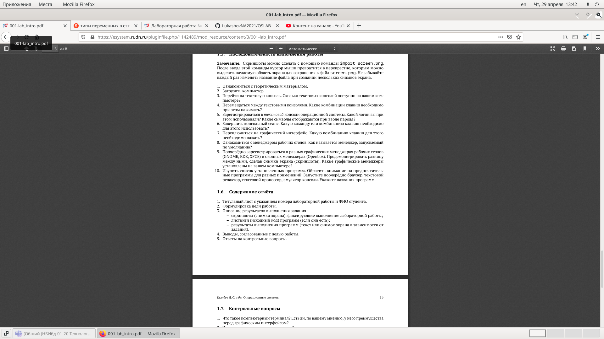
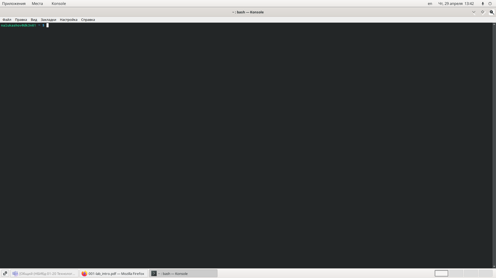
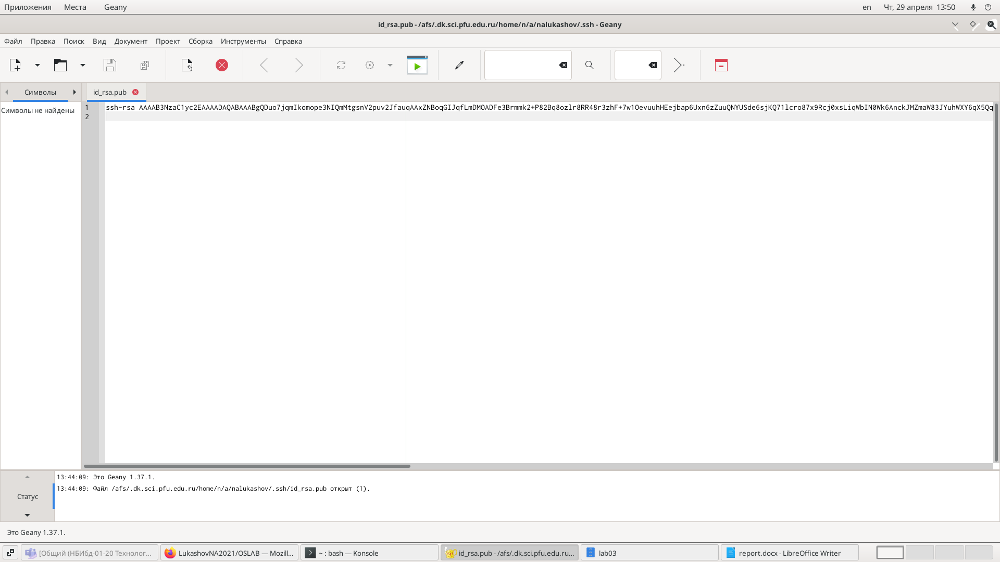
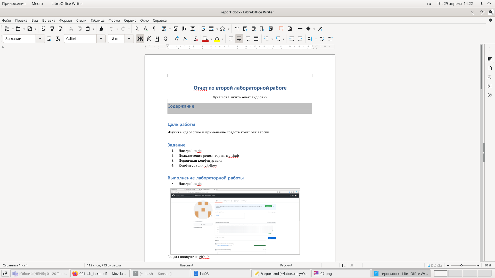

---
# Front matter
lang: ru-RU
title: "Отчет по четвертой лабораторной работе"

author: "Лукашов Никита Александрович"

# Formatting
toc-title: "Содержание"
toc: true # Table of contents
toc_depth: 2
lof: true # List of figures
lot: true # List of tables
fontsize: 12pt
linestretch: 1.5
papersize: a4paper
documentclass: scrreprt
polyglossia-lang: russian
polyglossia-otherlangs: english
mainfont: PT Serif
romanfont: PT Serif
sansfont: PT Sans
monofont: PT Mono
mainfontoptions: Ligatures=TeX
romanfontoptions: Ligatures=TeX
sansfontoptions: Ligatures=TeX,Scale=MatchLowercase
monofontoptions: Scale=MatchLowercase
indent: true
pdf-engine: lualatex
header-includes:
  - \linepenalty=10 # the penalty added to the badness of each line within a paragraph (no associated penalty node) Increasing the value makes tex try to have fewer lines in the paragraph.
  - \interlinepenalty=0 # value of the penalty (node) added after each line of a paragraph.
  - \hyphenpenalty=50 # the penalty for line breaking at an automatically inserted hyphen
  - \exhyphenpenalty=50 # the penalty for line breaking at an explicit hyphen
  - \binoppenalty=700 # the penalty for breaking a line at a binary operator
  - \relpenalty=500 # the penalty for breaking a line at a relation
  - \clubpenalty=150 # extra penalty for breaking after first line of a paragraph
  - \widowpenalty=150 # extra penalty for breaking before last line of a paragraph
  - \displaywidowpenalty=50 # extra penalty for breaking before last line before a display math
  - \brokenpenalty=100 # extra penalty for page breaking after a hyphenated line
  - \predisplaypenalty=10000 # penalty for breaking before a display
  - \postdisplaypenalty=0 # penalty for breaking after a display
  - \floatingpenalty = 20000 # penalty for splitting an insertion (can only be split footnote in standard LaTeX)
  - \raggedbottom # or \flushbottom
  - \usepackage{float} # keep figures where there are in the text
  - \floatplacement{figure}{H} # keep figures where there are in the text
---

# Цель работы

Познакомиться с операционной системой Linux,получить практические навыки работы с консолью и некоторыми графическими менеджерами рабочих столов операционной системы.

# Задание

1. Ознакомиться стеоретическим материалом.
2. Загрузить компьютер.
3. Перейти на текстовую консоль.Сколько текстовых консолей доступно на вашем ком-пьютере?
4. Перемещаться между текстовыми консолями.Какие комбинации клавиш необходимопри этом нажимать?
5. Зарегистрироваться в текстовой консоли операционной системы.Какой логин вы приэтом использовали? Какие символы отображаются при вводе пароля?
6. Завершить консольный сеанс.Какую команду или комбинацию клавиш необходимодля этого использовать?
7. Переключиться на графический интерфейс. Какую комбинацию клавиш для этого необходимо нажать?
8. Ознакомиться с менеджером рабочих столов.Как называется менеджер,запускаемый по умолчанию?
9. Поочерёдно зарегистрироваться в разных графических менеджерах рабочих столов(GNOME,KDE,XFCE) и оконных менеджерах (Openbox).Продемонстрировать разницу между ними, сделав снимки экрана (скриншоты). Какие графические менеджерыустановлены на вашем компьютере?
10. Изучить список установленных программ. Обратить внимание на предпочтительные программы для разных применений.Запустите поочерёдно браузер,текстовой редактор,текстовой процессор,эмулятор консоли.Укажите названия программ.

# Выполнение лабораторной работы

## Ознакамливаемся с учебным материалом

{width=70% }

Прочитали учебный материал.

## Загрузили компьютер

Переходим на текстовую консоль, их всего 6. По ним можно перемещаться с помощью комбинации клавишь ctr+alt+(f1-f6). При регистрации в консоли при в вводе пароля символы не отображаются.
Завершить сеанс текстовых консолей можно с помощью ctr+alt+f7. После этого мы переходим на графический интерфейс. 

## Менеджер рабочих столов

Существует несколько менеджеров рабочего стола. По умолчанию запускается GNOME.

## Регистрация в разных графических менеджерах.
 
{width=70% }
Перешли в XFCE.

{width=70% }
Перешли в GNOME.

{width=70% }
Перешли в OPENBOX.

{width=70% }
Перешли в Plasma.

Они имеют графические отличия между собой.

## Список установленных программ.

{width=70% }
Открыл браузер.

{width=70% }
Открыл эмулятор консоли.

{width=70% }
Открыл текстовый редактор.

{width=70% }
Открыл текстовой процессор.

## Вывод

Познакомился с операционной системой linux, получил практические навыки работы с консолью и некоторыми графическими менеджерами рабочих столов операционной системы.
