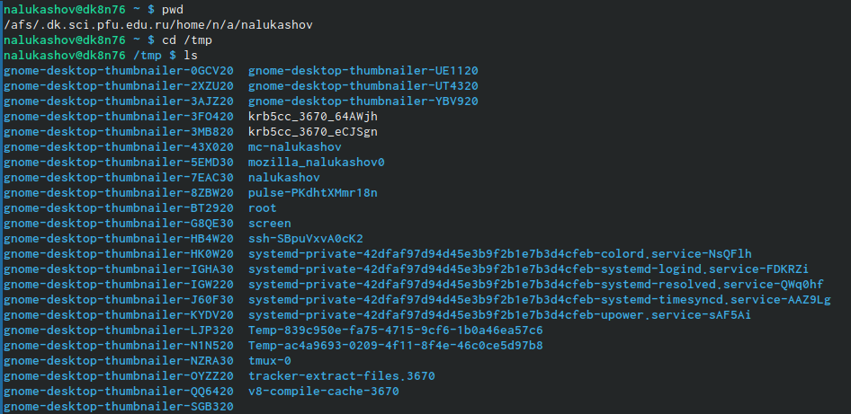
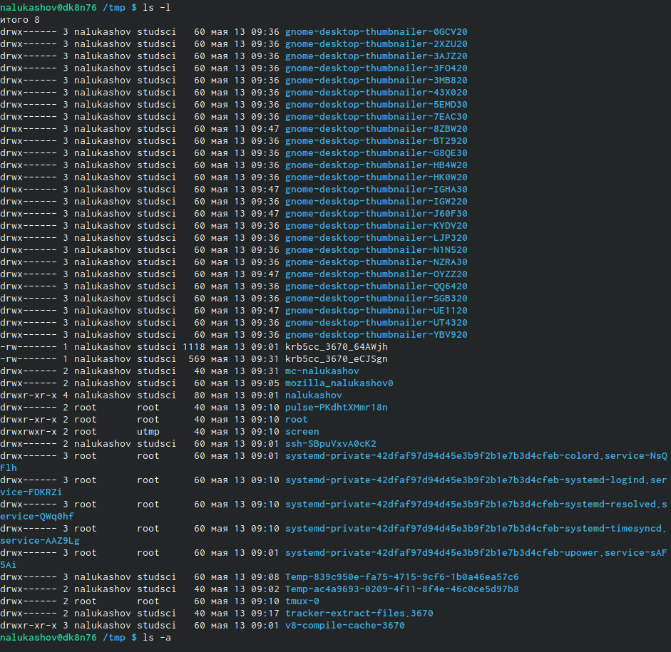
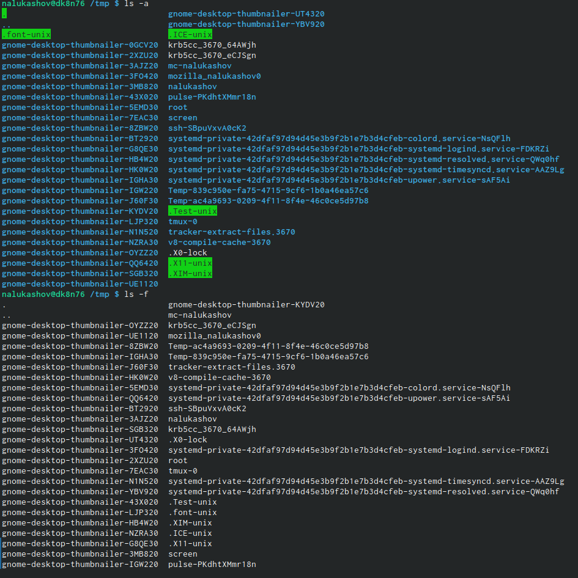
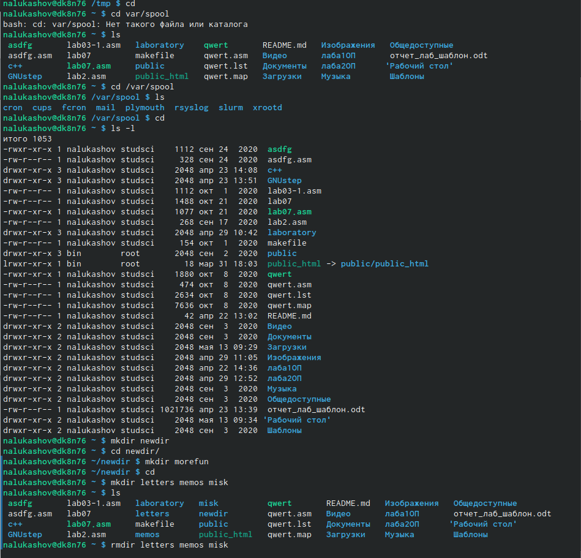
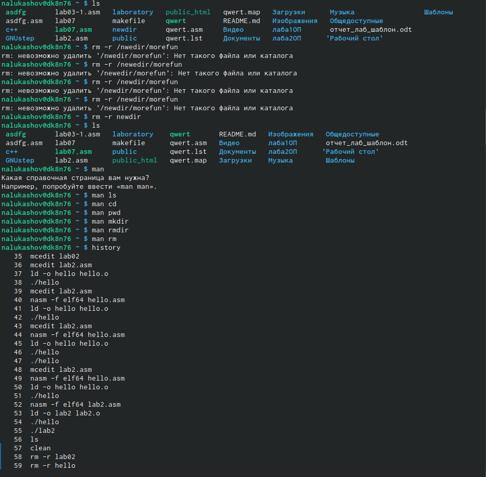
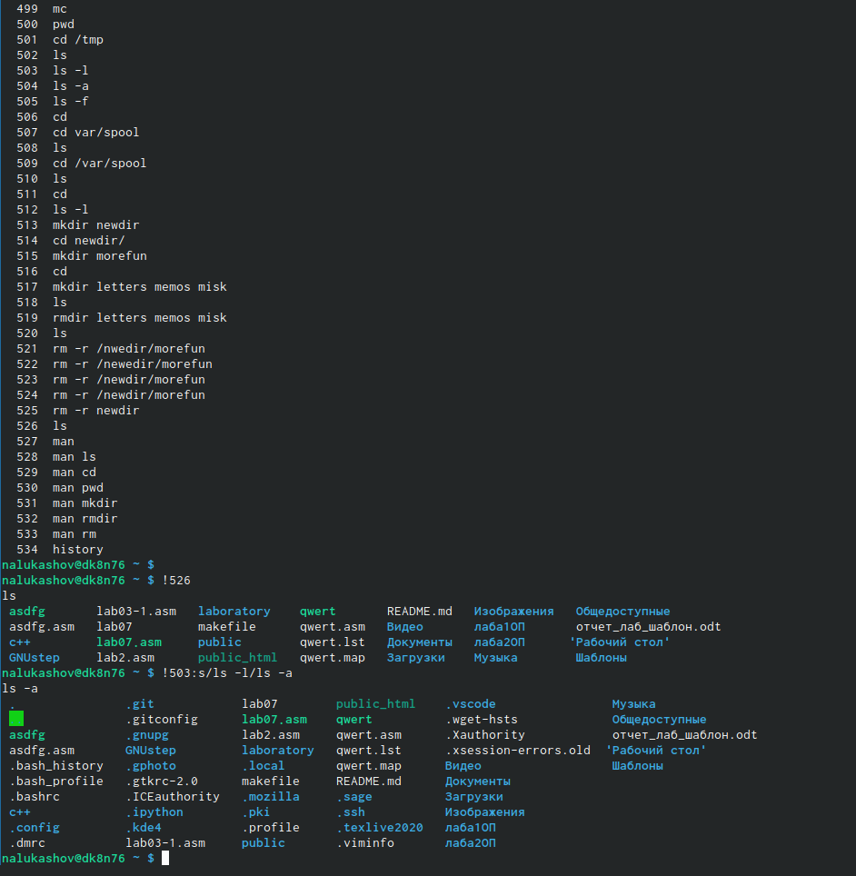

---
## Front matter
lang: ru-RU
title: Операционные системы
author: |
	Nikita A. Lukashov\inst{1}
institute: |
	\inst{1}RUDN University, Moscow, Russian Federation

## Formatting
toc: false
slide_level: 2
theme: metropolis
header-includes: 
 - \metroset{progressbar=frametitle,sectionpage=progressbar,numbering=fraction}
 - '\makeatletter'
 - '\beamer@ignorenonframefalse'
 - '\makeatother'
aspectratio: 43
section-titles: false
---

# Лабораторная работа №5

## Цели работы

Приобретение практических навыков взаимодействия пользователя с системой-
посредством командной строки.

## Задачи

1. Определите полное имя вашего домашнего каталога. Далее относительно
этого каталога будут выполняться последующие упражнения.
2. Выполните следующие действия:
3. Перейдите в каталог/tmp.
4. Выведите на экран содержимое каталога/tmp. Для этого используйте ко-
манду ls с различными опциями. Поясните разницу в выводимой на экран
информации.
5. Определите, есть ли в каталоге/var/spool подкаталог с именем cron?
6. Перейдите в Ваш домашний каталог и выведите на экран его содержи-
мое.Определите, кто является владельцем файлов и подкаталогов?
7. Выполните следующие действия:В домашнем каталоге создайте новый
каталог с именемnewdir.В каталоге~/newdirсоздайте новый каталог с име-
немmorefun.В домашнем каталоге создайте одной командой три новых
каталога с име-намиletters,memos,misk. Затем удалите эти каталоги одной
командой.Попробуйте удалить ранее созданный каталог~/newdirкомандой-
rm. Про-верьте, был ли каталог удалён.Удалите каталог~/newdir/morefunиз
домашнего каталога. Проверьте,был ли каталог удалён.
8. С помощью команды man определите, какую опцию командыь ls нужно
использовать для просмотра содержимое не только указанного каталога,
но и подкаталогов, входящих в него.
9. С помощью команды man определите набор опций команды ls, позволяю-
щий отсортировать по времени последнего изменения выводимый список содержимого каталога с развёрнутым описанием файлов.
10. Используйте командуmanдля просмотра описания следующих ко-
манд:cd,pwd,mkdir,rmdir,rm. Поясните основные опции этих команд.
11. Используя информацию, полученную при помощи команды history, выпол-
ните модификацию и исполнение нескольких команд из буфера команд.

## Определите полное имя вашего домашнего каталога. И вывели его содержимое

## Перешли в каталог tmp и вывели его содержимое.

 
## 

## 

## 

## Вывод

Приобрел практический навык взаимодействия с системой посредством командной строки.

