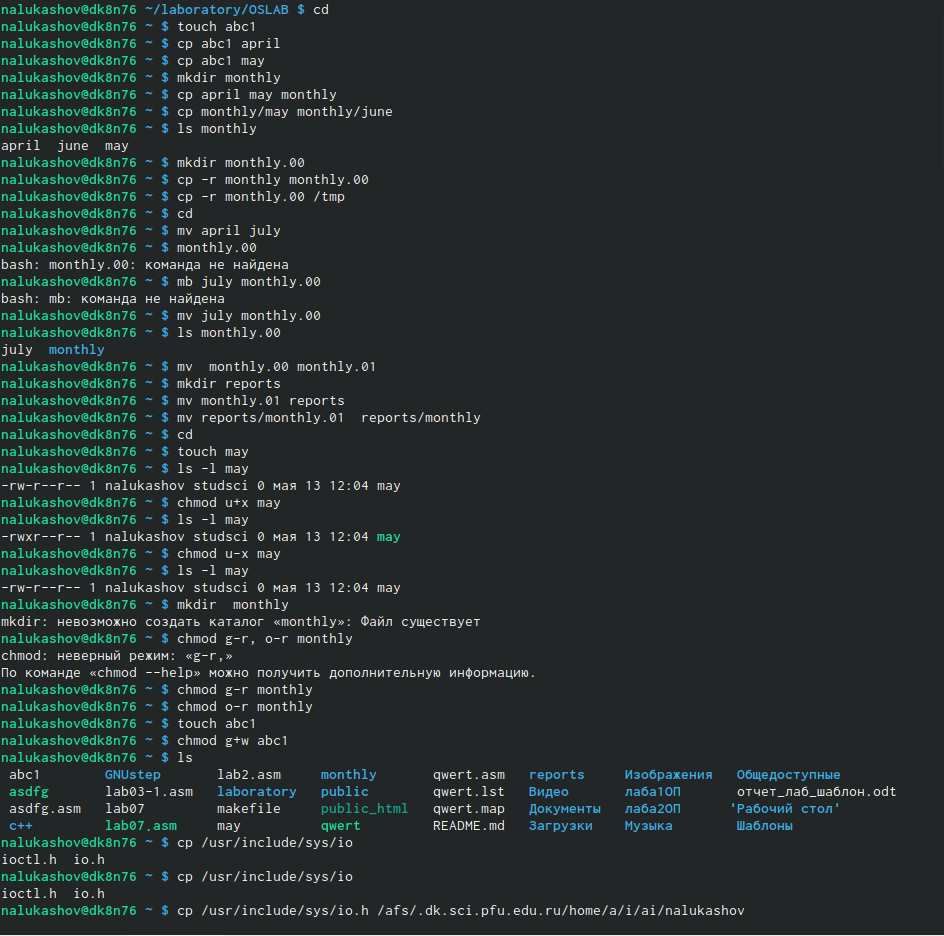
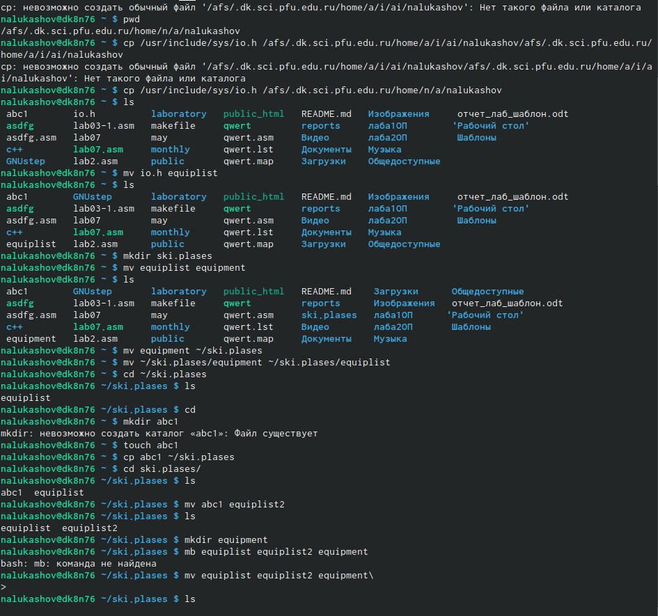
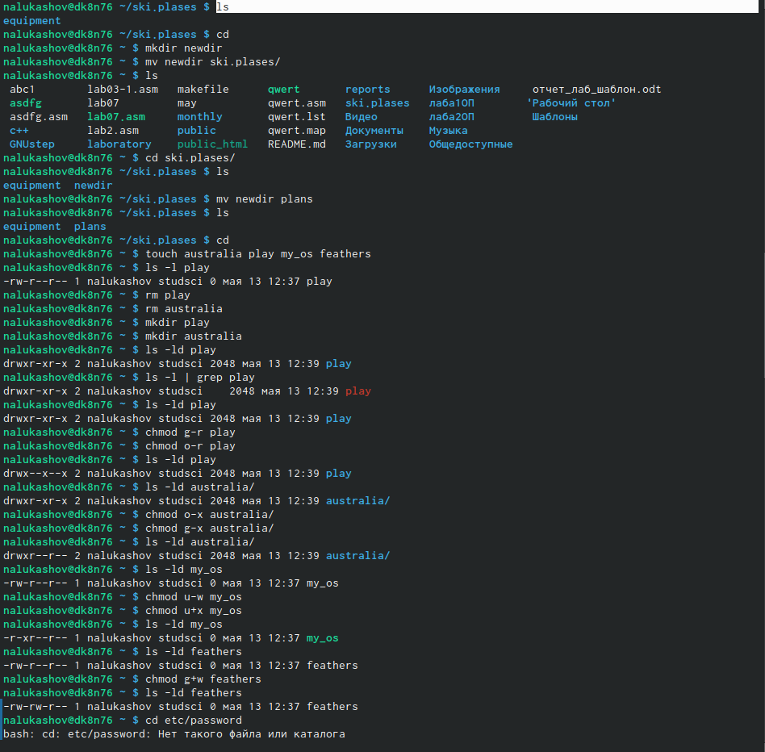
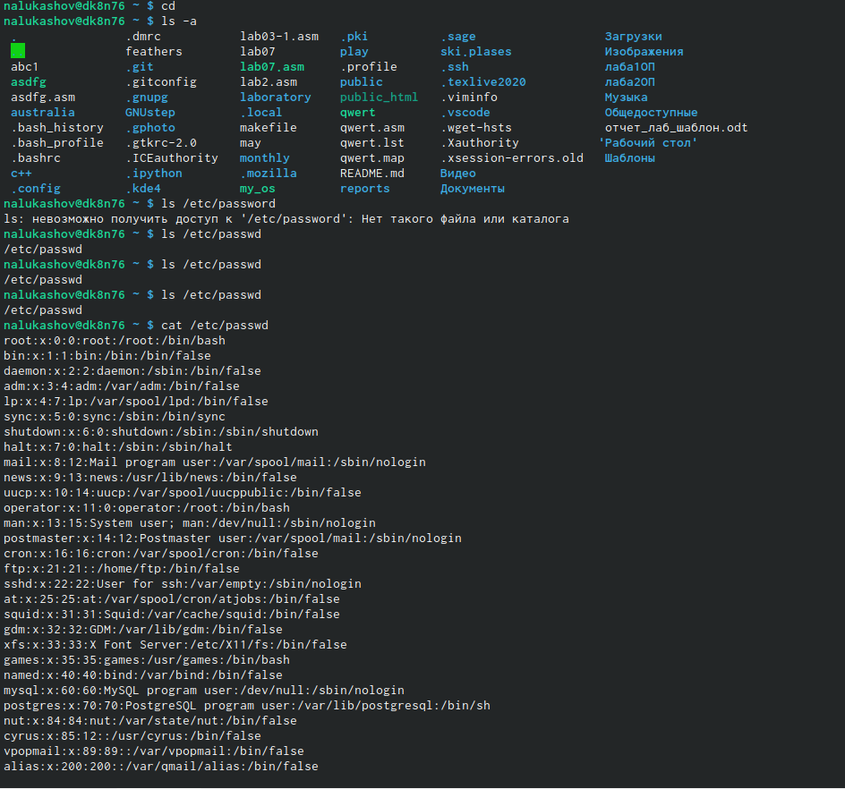
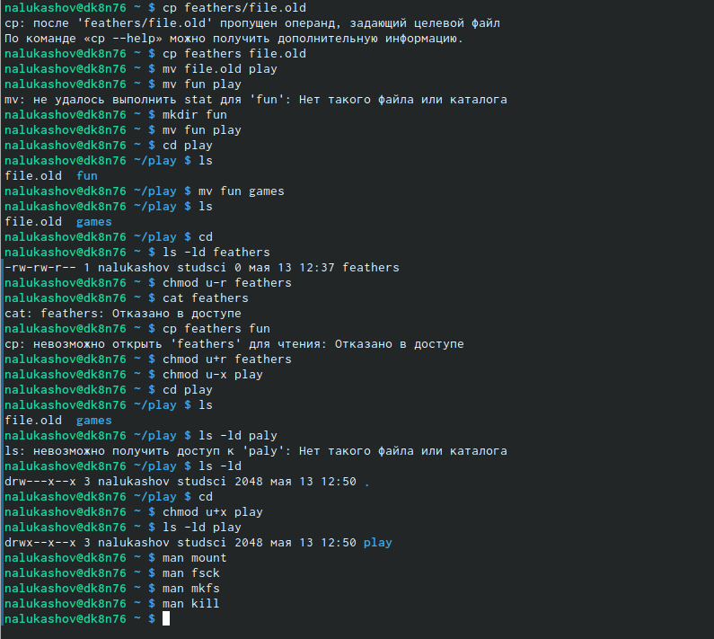

---
## Front matter
lang: ru-RU
title: Операционные системы
author: |
	Nikita A. Lukashov\inst{1}
institute: |
	\inst{1}RUDN University, Moscow, Russian Federation

## Formatting
toc: false
slide_level: 2
theme: metropolis
header-includes: 
 - \metroset{progressbar=frametitle,sectionpage=progressbar,numbering=fraction}
 - '\makeatletter'
 - '\beamer@ignorenonframefalse'
 - '\makeatother'
aspectratio: 43
section-titles: false
---

# Лабораторная работа №6

## Цели работы

Ознакомление с файловой системой Linux, её структурой, именами и содержанием каталогов. Приобретение практических навыков по применению команд дляработы с файлами и каталогами, по управлению процессами (и работами), по проверке использования диска и обслуживанию файловой системы.

## Задачи

1. Выполните все примеры, приведённые в первой части описания лабораторнойработы.
2. Выполните следующие действия, зафиксировав в отчёте по лабораторной работеиспользуемые при этом команды и результаты их выполнения:
3. Скопируйте файл/usr/include/sys/io.hв домашний каталог и назовитеегоequipment. Если файлаio.hнет, то используйте любой другой файл вкаталоге/usr/include/sys/вместо него.
4. В домашнем каталоге создайте директорию~/ski.plases.
5. Переместите файлequipmentв каталог~/ski.plases.
6. Переименуйтефайл~/ski.plases/equipmentв~/ski.plases/equiplist. Создайте в домашнем каталоге       файлabc1и скопируйте его в каталог~/ski.plases, назовите егоequiplist2.
7. Создайте каталог с именемequipmentв каталоге~/ski.plases.
8. Переместите файлы~/ski.plases/equiplistиequiplist2в каталог~/ski.plases/equipment.
9. Создайте и переместите каталог~/newdirв каталог~/ski.plasesи назо-вите егоplans.
10. Определите опции командыchmod, необходимые для того, чтобы присвоить пе-речисленным ниже файлам выделенные права доступа, считая, что в начале та-ких прав нет:
11. drwxr--r--   ...   australia
12. drwx--x--x   ...   play
13. -r-xr--r--   ...   my_os
14.   -rw-rw-r--   ...   feathersПри необходимости создайте нужные файлы.
15.  Проделайте приведённые ниже упражнения, записывая в отчёт по лабораторнойработе используемые при этом команды:
16. Просмотрите содержимое файла/etc/password.
17. Скопируйте файл~/feathersв файл~/file.old.
18. Переместите файл~/file.oldв каталог~/play.
19. Скопируйте каталог~/playв каталог~/fun.4.5.Переместите каталог~/funв каталог~/playи назовите егоgames.
20. Лишите владельца файла~/feathersправа на чтение.
21. Что произойдёт, если вы попытаетесь просмотреть файл~/feathersко-мандойcat?
22. Что произойдёт, если вы попытаетесь скопировать файл~/feathers?
23. Дайте владельцу файла~/feathersправо на чтение.
24. Лишите владельца каталога~/playправа на выполнение.
25. Перейдите в каталог~/play. Что произошло?
26. Дайте владельцу каталога~/playправо на выполнение.
27. Прочитайтеmanпо командамmount,fsck,mkfs,killи кратко их охарактери-зуйте, приведя примеры.

## Примеры

## 

 
## 

## 

## 

## Вывод

Ознакомился с файловой системой Linux, её структурой, именами и содержанием каталогов. Приобрел практических навыков по применению команд дляработы с файлами и каталогами, по управлению процессами (и работами), по проверке использования диска и обслуживанию файловой системы.

