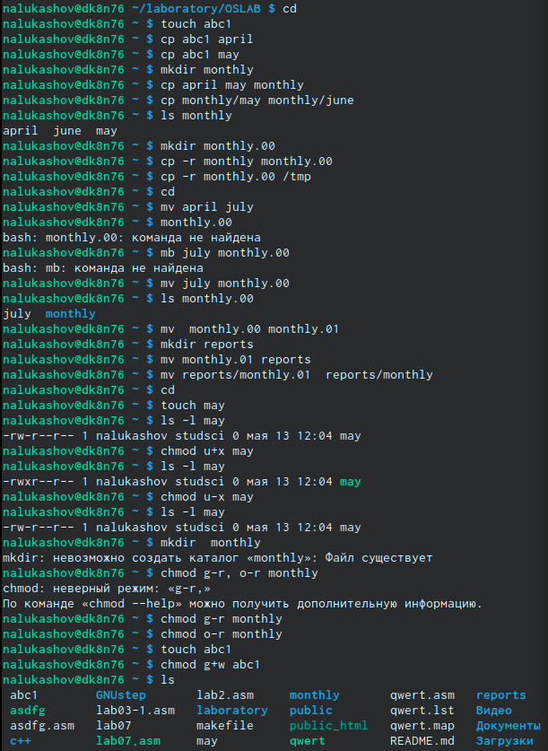
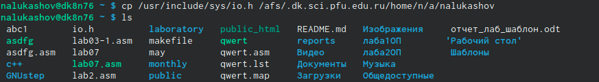
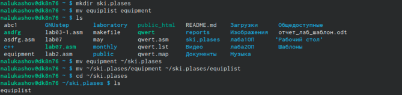
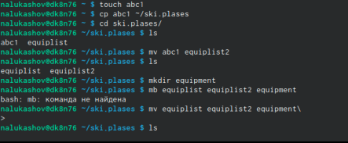
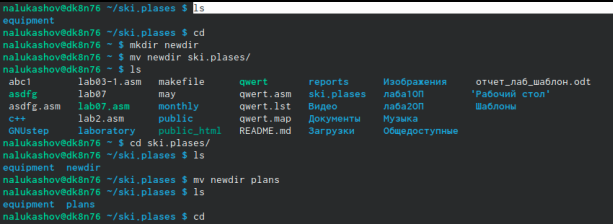
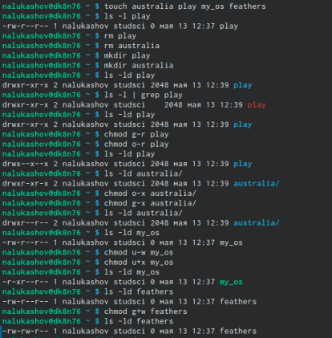
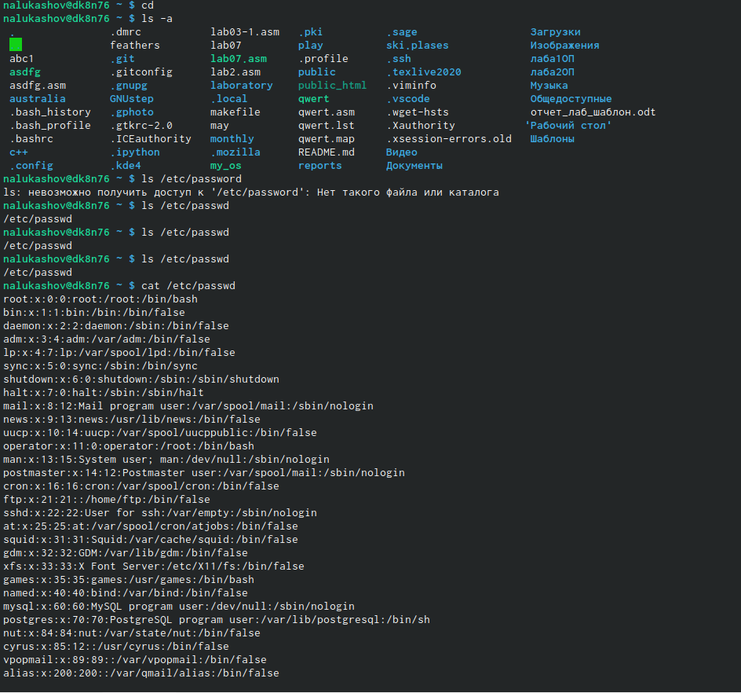
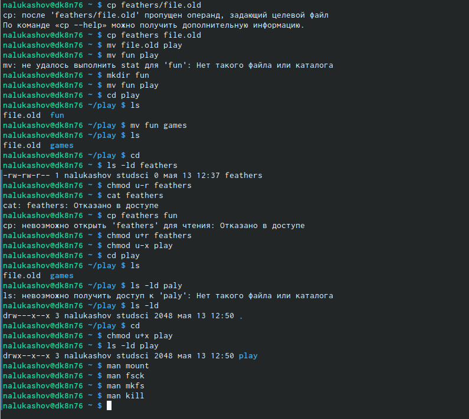

---
# Front matter
lang: ru-RU
title: "Отчет по шестой лабораторной работе"

author: "Лукашов Никита Александрович"

# Formatting
toc-title: "Содержание"
toc: true # Table of contents
toc_depth: 2
lof: true # List of figures
lot: true # List of tables
fontsize: 12pt
linestretch: 1.5
papersize: a4paper
documentclass: scrreprt
polyglossia-lang: russian
polyglossia-otherlangs: english
mainfont: PT Serif
romanfont: PT Serif
sansfont: PT Sans
monofont: PT Mono
mainfontoptions: Ligatures=TeX
romanfontoptions: Ligatures=TeX
sansfontoptions: Ligatures=TeX,Scale=MatchLowercase
monofontoptions: Scale=MatchLowercase
indent: true
pdf-engine: lualatex
header-includes:
  - \linepenalty=10 # the penalty added to the badness of each line within a paragraph (no associated penalty node) Increasing the value makes tex try to have fewer lines in the paragraph.
  - \interlinepenalty=0 # value of the penalty (node) added after each line of a paragraph.
  - \hyphenpenalty=50 # the penalty for line breaking at an automatically inserted hyphen
  - \exhyphenpenalty=50 # the penalty for line breaking at an explicit hyphen
  - \binoppenalty=700 # the penalty for breaking a line at a binary operator
  - \relpenalty=500 # the penalty for breaking a line at a relation
  - \clubpenalty=150 # extra penalty for breaking after first line of a paragraph
  - \widowpenalty=150 # extra penalty for breaking before last line of a paragraph
  - \displaywidowpenalty=50 # extra penalty for breaking before last line before a display math
  - \brokenpenalty=100 # extra penalty for page breaking after a hyphenated line
  - \predisplaypenalty=10000 # penalty for breaking before a display
  - \postdisplaypenalty=0 # penalty for breaking after a display
  - \floatingpenalty = 20000 # penalty for splitting an insertion (can only be split footnote in standard LaTeX)
  - \raggedbottom # or \flushbottom
  - \usepackage{float} # keep figures where there are in the text
  - \floatplacement{figure}{H} # keep figures where there are in the text
---

# Цель работы

Ознакомление с файловой системой Linux, её структурой, именами и содержанием каталогов. Приобретение практических навыков по применению команд дляработы с файлами и каталогами, по управлению процессами (и работами), по проверке использования диска и обслуживанию файловой системы.

# Задание

1. Выполните все примеры, приведённые в первой части описания лабораторнойработы.
2. Выполните следующие действия, зафиксировав в отчёте по лабораторной работеиспользуемые при этом команды и результаты их выполнения:
3. Скопируйте файл/usr/include/sys/io.hв домашний каталог и назовитеегоequipment. Если файлаio.hнет, то используйте любой другой файл вкаталоге/usr/include/sys/вместо него.
4. В домашнем каталоге создайте директорию~/ski.plases.
5. Переместите файлequipmentв каталог~/ski.plases.
6. Переименуйтефайл~/ski.plases/equipmentв~/ski.plases/equiplist. Создайте в домашнем каталоге       файлabc1и скопируйте его в каталог~/ski.plases, назовите егоequiplist2.
7. Создайте каталог с именемequipmentв каталоге~/ski.plases.
8. Переместите файлы~/ski.plases/equiplistиequiplist2в каталог~/ski.plases/equipment.
9. Создайте и переместите каталог~/newdirв каталог~/ski.plasesи назо-вите егоplans.
10. Определите опции командыchmod, необходимые для того, чтобы присвоить пе-речисленным ниже файлам выделенные права доступа, считая, что в начале та-ких прав нет:
11. drwxr--r--   ...   australia
12. drwx--x--x   ...   play
13. -r-xr--r--   ...   my_os
14.   -rw-rw-r--   ...   feathersПри необходимости создайте нужные файлы.
15.  Проделайте приведённые ниже упражнения, записывая в отчёт по лабораторнойработе используемые при этом команды:
16. Просмотрите содержимое файла/etc/password.
17. Скопируйте файл~/feathersв файл~/file.old.
18. Переместите файл~/file.oldв каталог~/play.
19. Скопируйте каталог~/playв каталог~/fun.4.5.Переместите каталог~/funв каталог~/playи назовите егоgames.
20. Лишите владельца файла~/feathersправа на чтение.
21. Что произойдёт, если вы попытаетесь просмотреть файл~/feathersко-мандойcat?
22. Что произойдёт, если вы попытаетесь скопировать файл~/feathers?
23. Дайте владельцу файла~/feathersправо на чтение.
24. Лишите владельца каталога~/playправа на выполнение.
25. Перейдите в каталог~/play. Что произошло?
26. Дайте владельцу каталога~/playправо на выполнение.
27. Прочитайтеmanпо командамmount,fsck,mkfs,killи кратко их охарактери-зуйте, приведя примеры.

# Выполнение лабораторной работы

- Выполните все примеры, приведённые в первой части описания лабораторной работы. 

{width=70% }
Выполнил все примеры приведенные в первой части описания лабораторной работы.

- Выполните следующие действия, зафиксировав в отчёте по лабораторной работеиспользуемые при этом команды и результаты их выполнения:

{width=70% }
Скопировал файл в домашний католог 

{width=70% }
Создал директорию в домашнем катологе, переместил файл *equipment* в каталог и переименовал его.

{width=70% }
Создал файл *abc1* скопировал его в каталог и назвал *equiplist2* 

{width=70% }
Создал и переместил новый каталог и навал его *plans*

- Определите опции команды chmod, необходимые для того, чтобы присвоить пе-речисленным ниже файлам выделенные права доступа, считая, что в начале таких прав нет.

{width=70% }
Создал 4 файла и присвоил им права доступа перечисленные в задании.

- Проделайте приведённые ниже упражнения, записывая в отчёт по лабораторнойработе используемые при этом команды

{width=70% }
Посмотрел содержимое файла etc/password

{width=70% } 
Скопировал файл *feathers* в *file.old.*
Переместил *file.old.* в */play*
Скопировал каталог */play* в каталог */fun*. 
Переместил каталог*/fun* в каталог */play* и назвал его *games*. 
Лишил владельца файла */feathers* права на чтение.
Если вы попытаетесь скопировать файл */feathers* система скажет что отказано в доступе. 
Дал владельцу файла */feathers* право на чтение.
Лишил владельца каталога */play* права на выполнение.
Перешел в каталог */play*.
Дал владельцу каталог */play* право на выполнение.

# Контрольные вопросы

3. Чтобы содержимое некоторой файловой системы было доступно операционной системе должно быть выполнено монтирование тома.

4. Основные причины нарушения целостности файловой системы: - Один блок адресуется несколькими mode (принадлежит нескольким файлам). - Блок помечен как свободный, но в то же время занят (на него ссылается onode). - Блок помечен как занятый, но в то же время свободен (ни один inode на него не ссылается). - Неправильное число ссылок в inode (недостаток или избыток ссылающихся записей в каталогах). - Несовпадение между размером файла и суммарным размером адресуемых inode блоков. - Недопустимые адресуемые блоки (например, расположенные за пределами файловой системы). - "Потерянные" файлы (правильные inode, на которые не ссылаются записи каталогов). - Недопустимые или неразмещенные номера inode в записях каталогов. Чтобы устранить повреждения файловой системы используется команда fsck.
5. Команда mkfs создаёт новую файловую систему. Например, создать файловую систему linux, семейства ext, на устройстве можно с помощью команды mkfs. Ее синтаксис выглядит следующим образом: sudo mkfs -t тип устройство.
6. Для просмотра небольших файлов применяется команда cat. Для просмотра больших файлов используют команду less — она позволяет осуществлять постраничный просмотр файлов (длина страницы соответствует размеру экрана). Для просмотра начала файла существует командой head (по умолчанию она выводит первые 10 строк файла). Формат команды: head [-n] имя-файла, где n — количество выводимых строк. А команда tail выводит несколько (по умолчанию 10) последних строк файла. Формат команды: tail [-n] имя-файла, где n — количество выводимых строк.
7. Основные возможности команды cp: - копирование файла в текущем каталоге. - копирование нескольких файлов в каталог. - копирование файлов в произвольном каталоге.
сp- команда копирования файлов и каталогов. Формат команды: cp [-опции] исходный_файл целевой_файл Например, нам необходимо скопировать файл abc1, находящийся в домашней папке в файл abc2 для этого: cp abc1 abc2.
8. mv - перемещение (переименование) файлов. Она перемещает (переименовывает) файл1 в целевой_файл. Файл1 не должен совпадать с целевым_файлом. Если целевой файл является каталогом, то файл1, файл2, ..., перемещаются в него под своими именами.
mvdir перемещает каталоги в пределах файловой системы. Если целевой_каталог не существует, он создается; в противном случае создается каталог с именем целевой_каталог/исходный_каталог. Исходный и целевой каталоги не могут лежать на одном маршруте, то есть ни один из них не может быть прямым или косвенным подкаталогом другого.
9. Каждый файл и каждая папка имеют три уровня доступа: право на чтение (обозначается буквой r), право на запись (т. е. редактирование и удаление файла; w) и право на исполнение (запуск) скрипта (x).

Права доступа к файлу или каталогу можно изменить, воспользовавшись командой chmod. Сделать это может владелец файла (или каталога) или пользователь с правами администратора. Формат команды: chmod режим имя_файла

# Вывод

Ознакомился с файловой системой Linux, её структурой, именами и содержанием каталогов. Приобрел практических навыков по применению команд дляработы с файлами и каталогами, по управлению процессами (и работами), по проверке использования диска и обслуживанию файловой системы.
